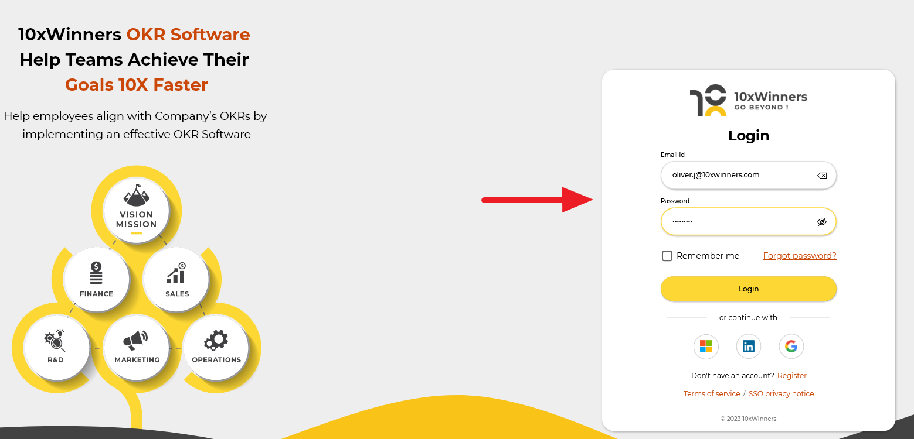

---
layout:
  title:
    visible: true
  description:
    visible: false
  tableOfContents:
    visible: true
  outline:
    visible: true
  pagination:
    visible: true
---

# Registration & Login

### Registration & Login

If you're a new user, kindly get registered with your organization details. If you're an existing user, log in with your credentials. Alternatively, you can log in using your Microsoft, LinkedIn, or Google account details by SSO (Single Sign-On) authentication method.

<figure><figcaption></figcaption></figure>

To get the complete product experience of 10XWinners OKR, try our _14-day free monthly_ and _yearly trials_. If you're happy with any of our product trials, kindly view the pricing and plan details to use this OKR management application.
